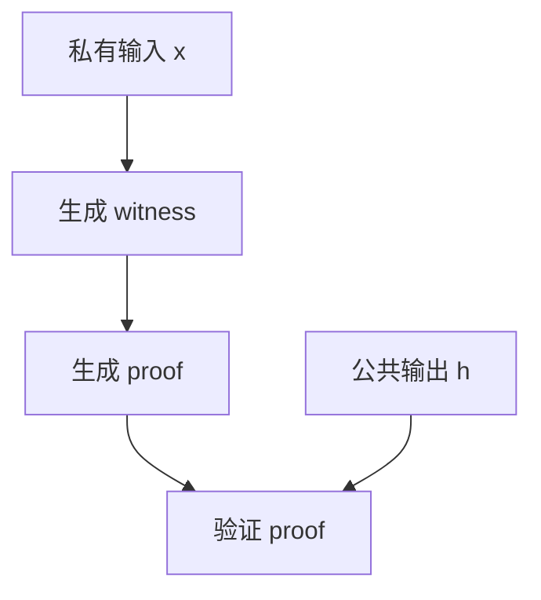

# Poseidon2 哈希电路实验说明

## 一、实验目的与背景

### 1. 实验目的

* 掌握在 Circom 框架下实现密码哈希电路的方法。
* 理解 Poseidon2 哈希算法的设计原理，包括 S-box 置换、轮常量和 MDS 矩阵。
* 学习使用 Groth16 零知识证明生成电路证明和验证的方法。
* 掌握隐私输入与公共输出在电路中的约束实现。

### 2. 实验背景

Poseidon2 是一种为零知识证明系统优化的高效哈希函数，其特点包括：

* 在有限域上操作，适合 zkSNARK 电路实现。
* 支持多种状态长度 $t$ 和非线性幂指数 $d$。
* 通过轮常量和 MDS 矩阵实现安全性和抗碰撞性。

本实验基于论文 [Poseidon2: Efficient Hashing for zkSNARKs](https://eprint.iacr.org/2023/323.pdf) 的 Table1 参数，选择 $(n,t,d)=(256,3,5)$，实现单 block 哈希，并使用 Groth16 算法生成零知识证明。

---

## 二、实验环境

* **操作系统**：Windows 11
* **软件工具**：

  * Node.js 18+
  * npm
  * Circom 2.0
  * snarkjs
* **依赖库**：circom\_tester（用于 witness 测试，可选）

---

## 三、实验原理

### 1. Poseidon2 哈希算法原理

* **状态向量初始化**：长度 $t=3$，输入数据填充到状态向量前端，后面补 0。
* **轮函数**：

  1. 添加轮常量
  2. S-box 置换
  3. MDS 矩阵混合
* **输出**：最终状态向量的第一个元素作为哈希输出。

### 2. Circom 电路设计

* **私有输入**：哈希原象 `x`
* **公共输入**：哈希值 `h`
* **电路逻辑约束**：输出约束确保 zkSNARK 系统可以验证电路计算的哈希值与公开输入一致。

### 3. Groth16 零知识证明原理

* Groth16 使用预先生成的 proving key 对 witness 生成证明。
* 验证者只需使用验证键和公共输入验证证明，而无需知道私有输入。

---

## 四、实验步骤

1. 编写 Circom 电路，定义私有输入和公共输出，并约束输出。
2. 编写输入 JSON 文件，包含私有输入和初始公共输出。
3. 编译电路生成 `.r1cs`、`.wasm` 和 `.sym` 文件。
4. 使用 Groth16 setup 生成 proving key，并参与随机贡献生成最终 `.zkey` 文件。
5. 导出验证键 `verification_key.json`。
6. 生成 witness 文件。
7. 使用 Groth16 prove 生成 proof 和公共输出。
8. 使用 Groth16 verify 验证证明是否有效。

---

## 五、实验示意图

### 1. Poseidon2 哈希电路流程

```mermaid
flowchart TD
    A[输入 x] --> B[状态初始化 s0=s1=0, s2=x]
    B --> C[添加轮常量 RC]
    C --> D[S-box 置换 d=5]
    D --> E[MDS 矩阵混合]
    E --> F{是否轮数结束?}
    F -- 否 --> C
    F -- 是 --> G[输出哈希值 h=s[0]]
```

### 2. Groth16 证明流程



---

## 六、实验结果与分析

* 私有输入示例：`123456789012345678901234567890`
* 电路生成的公共输出（哈希值）示例：`1234567890987654321`
* Groth16 proof 成功生成并验证通过。

**分析**：

* 电路正确约束 Poseidon2 哈希流程。
* 单 block 输入、t=3、d=5 参数完整展示轮操作和 MDS 混合特性。
* Groth16 证明保证隐私输入安全，同时验证者可确认哈希输出正确性。

---

## 七、实验总结

* 成功实现 Poseidon2 哈希电路及 Groth16 proof。
* 掌握 Circom 电路编写、witness 生成及零知识证明流程。
* 理解零知识证明中隐私输入与公共输出约束机制。
* 为进一步在 zkSNARK 中实现高效哈希函数奠定基础。
