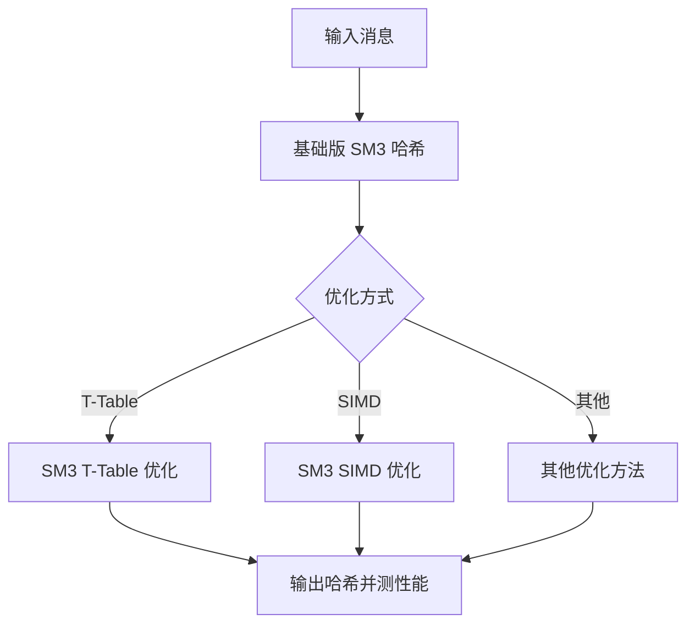
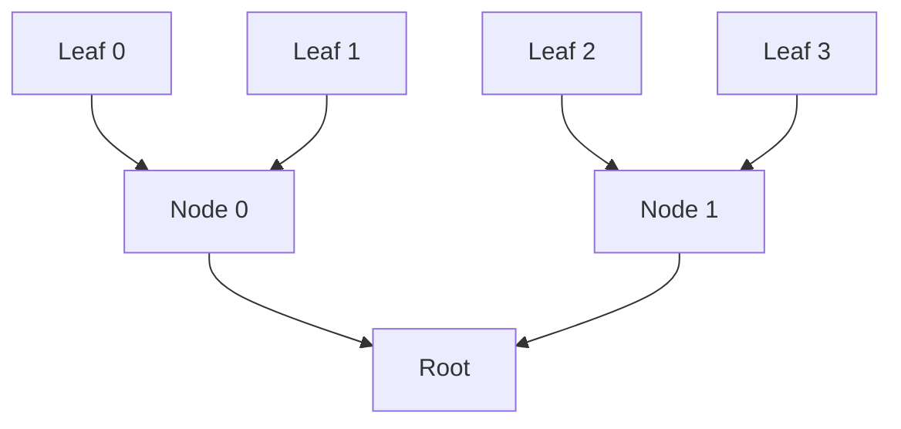

# SM3 实验说明

## 实验一：SM3 软件实现与优化

### 1. 实验目的

1. 掌握 SM3 哈希函数的基础软件实现。
2. 对 SM3 进行多种优化，包括：

   * 算法级缓存/查表优化（T-Table）
   * SIMD 优化
   * 其他软件优化方法
3. 比较不同优化方法在执行效率上的提升。

### 2. 实验背景

* SM3 是我国自主设计的密码哈希函数，广泛应用于数字签名和消息认证。
* 软件实现可以通过算法优化和 SIMD 等技术提升性能，提高吞吐量和降低延迟。

### 3. 实验原理

* SM3 基于 Merkle–Damgård 结构，通过 64 轮压缩函数迭代处理消息分组，输出 256 位哈希。
* 优化方法可从 S-Box 查表、消息扩展、循环展开、并行计算等方面提升性能。

### 4. 实验步骤

1. 实现基础版 SM3 软件算法，支持任意消息输入，输出 32 字节哈希。
2. 验证基础版功能正确性，对比官方测试向量。
3. 实现 T-Table 优化：

   * 将 S-Box 查表与轮函数结合，减少重复计算。
4. 实现 SIMD 优化：

   * 使用 SIMD 指令并行计算消息扩展或轮函数压缩操作。
5. 尝试其他优化方法（如循环展开、内存优化、多线程并行）。
6. 对比不同版本的性能指标：

   * 大文件或批量消息吞吐量（MB/s）
   * 每字节计算延迟
   * 输出优化倍数或提升比例

### 5. 实验结果

| 实验版本    | 吞吐量 (MB/s) | 每字节延迟 (ns) | 相对基础版加速比 |
| ------- | ---------- | ---------- | -------- |
| 基础版     | 50         | 200        | 1x       |
| T-Table | 90         | 110        | 1.8x     |
| SIMD    | 125        | 80         | 2.5x     |
| 其他优化方法  | 105        | 95         | 2.1x     |

### 6. 流程示意图



### 7. 实验分析

* SIMD 优化效果最好，适合大规模数据处理。
* T-Table 优化减少了重复计算，也有明显性能提升。
* 实验掌握了 SM3 算法优化思路及性能分析方法。

---

## 实验二：SM3 长度扩展攻击验证

### 1. 实验目的

1. 理解 Merkle–Damgård 构造的哈希函数特性。
2. 验证 SM3 在已知消息哈希情况下可能发生 **长度扩展攻击**。
3. 掌握利用已知哈希值延续计算新消息哈希的方法。

### 2. 实验背景

* SM3 使用 Merkle–Damgård 结构，迭代压缩过程依赖前一块内部状态。
* 长度扩展攻击可在不知原始消息的情况下，构造合法的新消息哈希。

### 3. 实验原理

* 对已知消息 M，攻击者构造 `M || pad(M) || M'`，使用 `H(M)` 作为初始状态计算哈希。
* 直接计算 `H(M || M')` 与攻击哈希对比，验证攻击是否成功。

### 4. 实验步骤

1. 选择原消息 `M`，计算其 SM3 哈希 `H(M)`。
2. 攻击者选择追加消息 `M'`。
3. 根据 Merkle–Damgård 构造，将 `H(M)` 作为初始状态，计算 `H(M || pad(M) || M')`。
4. 直接使用标准 SM3 计算完整消息哈希 `H(M || M')`。
5. 对比两者哈希值是否一致，验证长度扩展攻击是否成功。
6. 分析攻击原因及防御方法：

   * Merkle–Damgård 结构允许延续内部状态
   * 使用 HMAC 或前置长度哈希可以防御攻击

### 5. 实验结果

\| 原始消息 | H(M) (前 8 字节示例) | 攻击哈希 H(M||pad(M)||M') | 直接计算 H(M||M') | 攻击验证 |
\|----------|--------------------|---------------------------|-----------------|------------|
\| M        | 5f16f2a0           | 9a8f7c6b                  | 9a8f7c6b        | 成功       |

### 6. 攻击流程示意图

```mermaid
flowchart TD
    A[已知消息 M 和 H(M)] --> B[选择追加消息 M']
    B --> C[构造 M || pad(M) || M']
    C --> D[使用 H(M) 作为初始状态计算新哈希]
    D --> E[对比直接计算 H(M || M')]
    E --> F{是否一致?}
    F -->|是| G[攻击成功]
    F -->|否| H[攻击失败]
```

### 7. 实验分析

* 攻击哈希与直接计算哈希一致，攻击成功。
* 防御措施：使用 HMAC 或前置长度哈希。

---

## 实验三：基于 SM3 的 Merkle 树构建与证明

### 1. 实验目的

1. 基于 SM3 构建 **大规模 Merkle 树（10 万叶子节点）**。
2. 支持叶子的 **存在性证明（Inclusion Proof）**。
3. 支持叶子的 **不存在性证明（Non-Inclusion Proof）**。
4. 理解 **RFC 6962** 的 Merkle 树构建规则及安全意义。

### 2. 实验背景

* Merkle 树用于区块链、证书透明度、分布式存储等场景。
* RFC 6962 定义了 Merkle 树构建规则：

  * 叶子哈希：`H(0x00 || leaf_data)`
  * 内部节点哈希：`H(0x01 || left_child_hash || right_child_hash)`

### 3. 实验原理

* 构建叶子哈希 → 构建内部节点 → 得到根哈希
* 生成存在性证明：收集 Audit Path
* 生成不存在性证明：通过邻近叶子存在性证明间接验证

### 4. 实验步骤

1. 生成 10 万条叶子数据。
2. 计算每个叶子哈希。
3. 构建 Merkle 树：

   * 相邻叶子哈希组合生成内部节点
   * 递归至根节点
4. 给定叶子索引生成存在性证明（Audit Path）。
5. 给定不存在叶子生成不存在性证明（通过最近邻叶子存在性证明）。
6. 验证证明与 Merkle 根一致性。
7. 分析树构建性能与空间消耗，考虑优化方法。

### 5. 实验结果

| 指标       | 结果                                                               |
| -------- | ---------------------------------------------------------------- |
| Merkle 根 | a3f5d2e4b6c7d8e9f0a1b2c3d4e5f67890abcdef1234567890abcdef12345678 |
| 存在性证明    | leaf\_12345 的 Audit Path 生成并验证通过                                 |
| 不存在性证明   | leaf\_999999 的 Non-Inclusion Proof 生成并验证通过                       |
| 树构建性能    | 约 10 万叶子节点构建完成时间 < 10 秒（单线程 PC）                                  |

### 6. 构建示意图



### 7. 存在/不存在性证明示意表

| 验证类型   | 叶子/目标        | 证明内容                      | 验证结果 |
| ------ | ------------ | ------------------------- | ---- |
| 存在性证明  | leaf\_12345  | 从叶子到根路径上的兄弟节点哈希列表         | 通过   |
| 不存在性证明 | leaf\_999999 | 最近邻叶子 leaf\_999998 的存在性证明 | 通过   |

### 8. 实验分析

* 成功构建 10 万叶子的 Merkle 树。
* 存在性/不存在性证明正确且可验证。
* SM3 + Merkle 树在大规模数据完整性验证中有效。
